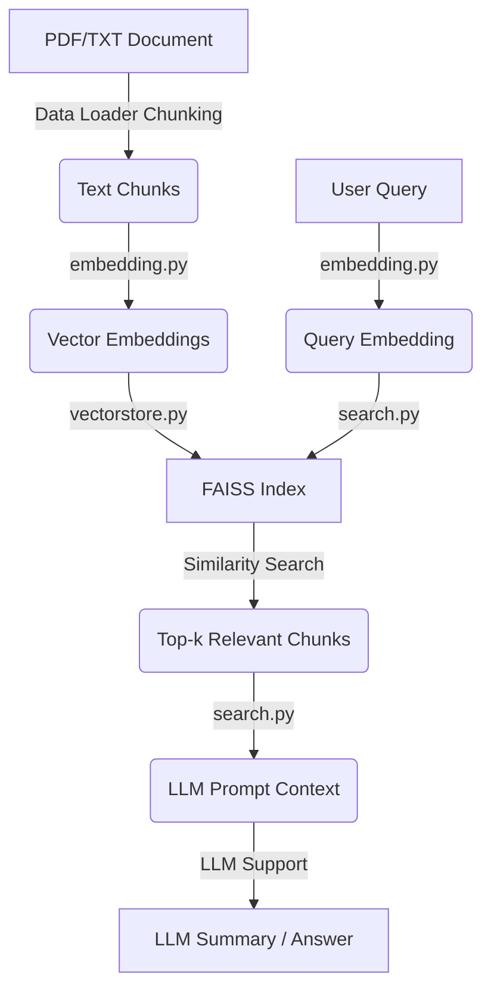

# 🧠 RAG From Scratch: A Hands-on Implementation of Retrieval-Augmented Generation

A personal, from-scratch, and fully transparent implementation of a complete Retrieval-Augmented Generation (RAG) system.

This repository is designed for learning, debugging, and understanding how modern RAG pipelines work without relying on heavy, abstracted frameworks. Every component is implemented from scratch for maximum clarity.

---

## 🚀 Features

### 📄 Document Loading
The system includes modular loaders for multiple document formats:
- PDF files (`.pdf`)
- Plain text (`.txt`)
- Word documents (`.docx`)
- Excel spreadsheets (`.xlsx`, `.xls`)
- CSV files (`.csv`)
- JSON files (`.json`)
- Automatic chunking for long documents to manage context size

### 🔢 Embedding Generation
Generates numerical representations (embeddings) for text chunks:
- Uses `SentenceTransformer` (`all-MiniLM-L6-v2`) by default for efficient local operation
- Can easily be configured to use external services like OpenAI embeddings

### 🧠 Vector Storage
Offers flexibility with two core backend options for storing and searching embeddings:

| Backend | Description |
|---------|-------------|
| **FAISS** | Highly performant library for fast similarity search in memory |
| **Chroma** (optional) | A persistent, on-disk vector database |

### 🔍 RAG Pipeline
The core logic performs the standard RAG sequence:
1. **Retrieve**: Find the top-k relevant text chunks using the FAISS index based on the user query
2. **Construct Context**: Combine the retrieved chunks into a single context prompt
3. **Generate**: Forward the query and context to an LLM for summarization or question answering

### 🤖 LLM Support
Currently configured for OpenAI models by default:
- OpenAI models (e.g., `gpt-4`, `gpt-3.5-turbo`, `gpt-4-turbo`)

The framework is designed to be model-agnostic and can be easily adapted to support other LLM providers such as:
- Groq models (e.g., `Gemma2`, `Llama3`)
- Anthropic Claude
- Local models via Ollama
- Any other LLM API

Users can modify the LLM configuration in the source code to adapt to their preferred model.

---

## 📁 Project Structure

```
RAG_STUDY/
│
├── notebook/
│   ├── document.ipynb        # Document ingestion, preprocessing, chunking
│   └── pdf_loader.ipynb      # PDF parsing and extraction tests
│
├── src/
│   ├── __pycache__/          # Python cache files
│   ├── __init__.py           # Package initializer
│   ├── data_loader.py        # Handles loading and chunking (PDF, TXT)
│   ├── embedding.py          # Embedding model initialization
│   ├── search.py             # Main RAG execution logic
│   └── vectorstore.py        # FAISS and Chroma integration
│
├── .gitattributes            # Git configuration
├── app.py                    # Main application entry point
├── README.md                 # This file
└── requirements.txt          # Python dependencies
```

---

## 🧪 Quick Start

### 1. Install dependencies
```bash
pip install -r requirements.txt
```

### 2. Add OpenAI key (if using OpenAI models)
Create a file named `.env` in the root directory:
```ini
OPENAI_API_KEY=your_api_key
```

### 3. Edit and run `app.py`
Simply edit the query in `app.py` and run it:

```bash
python app.py
```

The `app.py` file contains the complete RAG pipeline:

```python
from src.data_loader import load_all_documents
from src.vectorstore import FaissVectorStore
from src.search import RAGSearch

# Example usage
if __name__ == "__main__":
    
    docs = load_all_documents("data")
    store = FaissVectorStore("faiss_store")
    #store.build_from_documents(docs)  # Uncomment to rebuild index
    store.load()
    
    rag_search = RAGSearch()
    query = "What is AI compression?"
    summary = rag_search.search_and_summarize(query, top_k=3)
    print("Summary:", summary)
```

**To use:**
- Edit the `query` variable to ask your own questions
- Uncomment `store.build_from_documents(docs)` if you need to rebuild the FAISS index
- Run with `python app.py`

---

## 🧩 How the System Works

This diagram illustrates the flow of data through the modular RAG system:



Each stage is designed to be modular and easy to swap with different models or retrieval strategies.

---

## 📂 Core Modules

### `src/data_loader.py`
Handles document loading and chunking for PDF and TXT files. Automatically splits long documents into manageable chunks.

### `src/embedding.py`
Manages the embedding model initialization. Uses SentenceTransformer by default for generating text embeddings.

### `src/vectorstore.py`
Provides FAISS and Chroma vector store implementations for efficient similarity search.

### `src/search.py`
Contains the main RAG pipeline logic that orchestrates retrieval and generation.

### `app.py`
The main entry point that demonstrates how to use the RAG system end-to-end.

---

## 📌 Future Improvements

- Add reranking capabilities (e.g., BGE / ColBERT) to improve retrieval precision
- Implement dedicated OpenAI embedding support as a built-in option
- Integrate an evaluation framework (retrieval accuracy & latency)
- Develop a user interface (UI) using FastAPI or Gradio
- Add loaders for DOCX and HTML files

---

## 🎯 Purpose

This project exists to give a transparent, step-by-step understanding of how RAG systems are designed, built, and optimized.

**It is ideal for:**
- Students and Researchers
- Developers learning vector databases
- Anyone building production RAG systems and seeking deeper knowledge

---

## 💡 Inspiration

This project was inspired by the excellent tutorial: [RAG From Scratch](https://www.youtube.com/watch?v=o126p1QN_RI)

The goal was to take the concepts presented and build a complete, transparent implementation that demonstrates each component of a RAG system in a clear and educational way.

---

## 📜 License

This project is distributed under the MIT License. See the LICENSE file for more details.